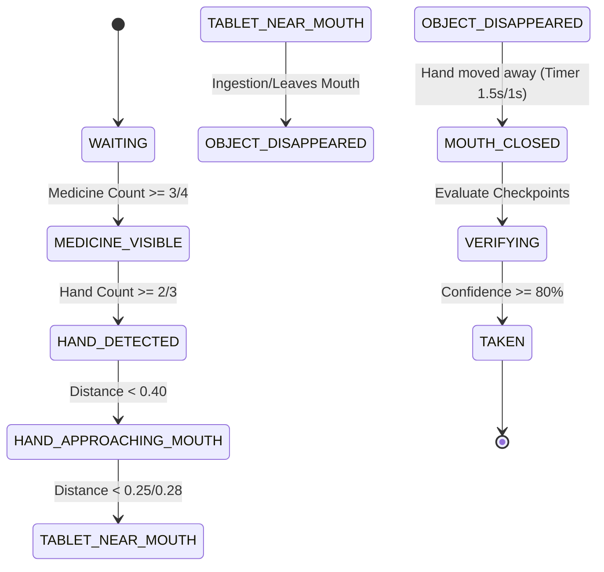

# Project Working - MediVerify AI Technical Architecture

This document provides a comprehensive technical overview of the MediVerify AI system. It details the project's layout, frontend canvas optimizations, backend singleton design, computer vision heuristics, state machine transitions, mathematical confidence engine rules, and Firestore database collections.

---

## 📂 Folder Structure

```text
mediverify-ai/
├── backend/
│   ├── api/                   # FastAPI routes (auth, verification, analytics, users, etc.)
│   ├── app/                   # App dependencies and global startup routines (dependencies.py)
│   ├── config/                # Configuration management and env schemas (settings.py)
│   ├── core/                  # Database client helpers and constants (constants.py)
│   ├── data/                  # Primary medicines databases (medicines.json)
│   ├── firebase/              # Firebase Admin initialization and credentials
│   ├── ocr/                   # EasyOCR engine wrap and image preprocessing service
│   ├── routers/               # App router bindings
│   ├── schemas/               # Pydantic models for request/response serialization
│   ├── scripts/               # DB seed tools
│   ├── services/              # Business logic (doctor monitor daemon, prescription LLM parser)
│   ├── temp/                  # Temp storage directory for processing upload scans
│   ├── verification/          # State machine strategies (state_machine.py, strategy.py)
│   ├── vision/                # OpenCV & YOLOv8 tracking heuristics
│   └── main.py                # FastAPI server entry point
├── docs/                      # General architectural guides
├── frontend/
│   ├── src/
│   │   ├── components/        # Reusable Tailwind UI components (PageShell, SectionCard)
│   │   ├── contexts/          # Authentication and patient contexts
│   │   ├── hooks/             # Custom React Hooks
│   │   ├── layouts/           # App layouts and glassmorphic shells
│   │   ├── pages/             # Route-specific views (Upload, Verify, Dashboards)
│   │   ├── routes/            # Protected route configurations
│   │   ├── services/          # HTTP client wrappers (api.js, analyticsService.js)
│   │   └── utils/             # Front-end routing constants
│   ├── index.html
│   ├── tailwind.config.js     # CSS styling tokens
│   └── vite.config.js         # Client compilation configuration
└── running/                   # Hackathon documentation folder
```

---

## 🏗️ Architecture Design

### 1. Frontend Client Architecture (React & Canvas)
* **Client-Side Motion Filtering**: To prevent overloading the backend with empty frames, the client performs motion estimation using canvas pixel evaluation:
  1. The video stream frame is downscaled onto a small hidden canvas ($40 \times 30$ pixels).
  2. The Red, Green, and Blue channel values of each pixel are compared against the previous frame:
     $$\Delta = \sum_{i=0}^{N} \left( |R_t - R_{t-1}| + |G_t - G_{t-1}| + |B_t - B_{t-1}| \right)$$
  3. The average difference is computed:
     $$\text{AvgDiff} = \frac{\Delta}{40 \times 30 \times 3}$$
  4. If $\text{AvgDiff} > 9$ (sensitivity threshold) and at least $1.2$ seconds have elapsed, the high-res canvas frame is captured as a Base64 JPEG and sent to the server.
  5. A heartbeat fallback sends a frame every $4.5$ seconds even if no motion is detected to ensure continuity.
* **Scanning HUD Overlay**: Renders dynamic floating status badges (Hand, Face status) and overlays a Google Lens-style scanning line animation to guide users.

### 2. Backend Server Architecture (FastAPI & Vision Singletons)
* **API Route Handlers**: FastAPI endpoints handle async HTTP payloads and dependency injection models.
* **Lazy Loading singletons**: Heavily complex deep-learning/OCR models (YOLOv8, EasyOCR) are lazily instantiated on their first API invocation and held in memory to optimize server start times.
* **Role-Based Access Control (RBAC)**: Enforced via `get_current_user` dependency validating bearer ID tokens issued by Firebase Auth:
  * **Patients** can only access and update schedules tied to their own patient UID.
  * **Doctors** can only audit patient panels listed in their `assignedPatients` array.
  * **Caregivers** can only review logs of patients listed in their `linkedPatients` array.

---

## 🖐️ Computer Vision Tracking Heuristics

The backend does **not** run Google MediaPipe. Instead, it utilizes YOLOv8 Person/Object boxes combined with OpenCV skin heuristics and adaptive contrast checks:

### 1. Hand Tracking Pipeline
1. **Person Detection**: Run YOLOv8 on the frame to locate person bounding boxes (class ID 0) with a confidence threshold $\ge 0.40$.
2. **Body Crop**: Crop the person box, discarding the top 20% of the box to exclude the head region.
3. **HSV skin-color checking**: Segment colors within the cropped body region using skin ranges:
   $$\text{Lower Skin} = [0, 20, 70], \quad \text{Upper Skin} = [20, 255, 255]$$
4. **Contour Extraction**: Gaussian blur the skin mask, dilate it, and extract contours.
5. **Centroid Estimation**: Contours with an area $> 1500$ are classified as hand centroids. The hand's coordinates $(x_{hand}, y_{hand})$ are computed using image moments:
   $$x_{hand} = \frac{M_{10}}{M_{00}}, \quad y_{hand} = \frac{M_{01}}{M_{00}}$$

### 2. Face Tracking & Mouth Status Pipeline
1. **Head Crop**: Crop the top 35% of the YOLOv8 person bounding box to isolate the head.
2. **Skin Segmentation**: Apply HSV skin segmentation to locate the exact face boundary. If no skin area matches, use the estimated head crop bounding box directly.
3. **Mouth ROI Isolation**: Extract the mouth region, estimated as the lower 1/3 and center 50% width of the face bounding box.
4. **Adaptive Grayscale Thresholding**: Convert the mouth ROI to grayscale and calculate its mean brightness. Apply an adaptive threshold to isolate dark pixels (which indicate an open mouth cavity):
   $$\text{Threshold} = \text{Clamp}(\text{MeanBrightness} \times 0.55, 20, 85)$$
   $$\text{Dark Ratio} = \frac{\text{Count}(\text{Pixels} < \text{Threshold})}{\text{Total ROI Pixels}}$$
5. **Temporal Debounce (Hysteresis)**: Maintain a rolling history of the last 10 frames.
   * If $\text{Dark Ratio} > 0.36$, increment `consecutive_open_count`.
   * If $\text{Dark Ratio} < 0.30$, increment `consecutive_closed_count`.
   * Open transition requires 3 consecutive open frames. Closed transition requires 3 consecutive closed frames.

---

## 🔄 Verification State Machine Strategies

The system switches verification strategy based on the `VERIFICATION_MODE` configuration:



### 1. Production Verification Strategy
Requires physical ingestion:
1. `WAITING`: Detects medicine (strip/tablet/box) in front of the camera (stable count $\ge 3$).
2. `MEDICINE_VISIBLE`: Waits for hand presence in frame (stable count $\ge 2$).
3. `HAND_DETECTED`: Tracks distance between hand and mouth.
4. `HAND_APPROACHING_MOUTH`: Hand approaches face (distance $< 0.40$).
5. `TABLET_NEAR_MOUTH`: Hand is near mouth region (distance $< 0.25$). Monitors for mouth opening.
6. `OBJECT_DISAPPEARED`: The tablet must permanently disappear from the frame while the hand is in the mouth region and the mouth is open.
7. `MOUTH_CLOSED`: The user must move their hand away from the face, face remains visible, no medicine remains near mouth, and the mouth closes (swallowing confirmation) for at least $1.5$ seconds.
8. `VERIFYING` $\rightarrow$ `TAKEN`: Confirms final state and logs status in Firestore.

### 2. Demo Verification Strategy
Simulates ingestion safely via gestures:
* **Hysteresis Noise Filters**: Frame detections increment state counters when active, and decrement them by 1 when absent (clamped between 0 and 10) to prevent temporary webcam drops from resetting progress.
* **Sequence Transitions**:
  * Transition to `TABLET_NEAR_MOUTH` requires distance $< 0.28$ (for stable count $\ge 3$).
  * User must hold their hand near their mouth for at least **$0.8$ seconds** (`NEAR_START` timer verification).
  * Transition to `OBJECT_DISAPPEARED` triggers when the user pulls their hand back (distance $\ge 0.40$ or hand disappears).
  * Transition to `MOUTH_CLOSED` completes after a **$1.0$-second** confirmation delay. If mouth closed status is not physically tracked due to webcam framing, a timeout fallback ($3.0$ seconds) auto-transitions to prevent lockup.
  * Terminal confidence scores are auto-boosted to at least $85\%$ to ensure demo success.

---

## 📊 Confidence Engine Mathematics

The final confidence score (capped at 100%) is calculated dynamically using a multi-factor evidence system:

$$\text{Confidence} = \text{TextMatchScore} + \text{StateSequenceScore} + \text{MouthOpenedBonus} + \text{StabilityBonus} + \text{MouthClosedBonus}$$

### 1. OCR Text Match Score (Max 25%)
Matches the text extracted by EasyOCR against the scheduled medicine name:
1. Candidate matching runs across:
   * **Stage 1 (Exact)**: If line name matches candidate name $\rightarrow 100$.
   * **Stage 3 (Substring)**: If line/candidate string is contained within the other $\rightarrow 90$.
   * **Stage 4 (Fuzzy)**: Compute RapidFuzz `WRatio` similarity. If $< 70$, candidate is ignored.
2. Apply Synonym Multipliers:
   * Match matches expected name: $1.0$
   * Match matches `CUSTOM_ALIASES` (e.g. Paracetamol $\leftrightarrow$ Crocin): $0.95$
   * Match matches `medicines.json` database aliases: $0.90$
3. Apply Strength Validation Score:
   * Expected strength matches OCR strength: $+5.0$ bonus
   * Expected strength mismatches OCR strength: $\times 0.1$ penalty
   * Expected strength missing in OCR: $\times 0.9$ slight penalty
4. Apply Dosage Form Validation Score:
   * Expected form matches OCR form: $+2.0$ bonus
   * Expected form mismatches OCR form: $\times 0.8$ penalty
5. Apply Ollama database factor:
   * If expected drug name exists in `medicines.json` primary database: $\times 1.0$
   * If expected drug was parsed by LLM but not in database: $\times 0.8$
6. Finalize:
   $$\text{TextMatchScore} = \text{BestMatchConf} \times 0.25$$

### 2. State Sequence Score (Max 75%)
* `MEDICINE_VISIBLE` reached: $+15\%$
* `HAND_DETECTED` reached: $+10\%$
* `HAND_APPROACHING_MOUTH` reached: $+10\%$
* `TABLET_NEAR_MOUTH` reached: $+15\%$
* `OBJECT_DISAPPEARED` reached: $+15\%$
* `MOUTH_CLOSED` reached: $+10\%$

### 3. Mouth Opened Bonus (+15%)
Triggered if a mouth-opened state is registered after the medicine becomes visible.

### 4. Stability Bonus (Max 10%)
* Stable medicine visible ($\ge 4$ frames): $+5\%$
* Stable hand tracking ($\ge 3$ frames): $+5\%$

### 5. Mouth Closed Bonus (+10%)
Added if a stable mouth closed state ($\ge 2$ frames) is registered at sequence completion.

---

## 🕒 Daily Schedule & Reminder Flows

* **Schedule Generation**:
  * Triggered when the patient confirms their parsed prescription.
  * Medication durations are parsed into integers (e.g. '7 days' $\rightarrow 7$, '2 weeks' $\rightarrow 14$, default fallback is 7).
  * Timing strings generate daily schedules mapped to local time zone (`Asia/Kolkata`):
    * **Morning**: 08:00
    * **Afternoon**: 14:00
    * **Evening**: 19:00
    * **Night**: 22:00
    * *Default fallback is Morning.*
* **Due Alerts**:
  * The client queries `/api/reminders/due?patientId=...` continuously.
  * The backend returns pending schedules where:
    $$\text{CurrentTime} \ge \text{ScheduledDateTime} - \text{RemindBeforeMinutes}$$
  * Default `remindBeforeMinutes` is 15 minutes.
  * When a notification is shown, the client patches `/reminders/{id}/notification-sent` to update `notificationSentAt` in Firestore.

---

## 🩺 Doctor & Caregiver Monitoring Daemon

* **Monitoring Daemon**:
  * Starts as a background thread daemon on backend application startup.
  * Executes an adherence audit sweep every 30 minutes.
* **Audit Logic**:
  1. Scans all registered patients and retrieves schedules.
  2. Flags a schedule as missed if its status is "Pending" and current time is $> 2$ hours past due:
     $$\text{CurrentTime} > \text{ScheduledDateTime} + \text{GracePeriod (2 hours)}$$
  3. Computes the Patient's overall compliance rate:
     $$\text{Adherence Rate} = \frac{\text{Taken Doses}}{\text{Taken Doses} + \text{Missed Doses}} \times 100$$
  4. If a patient's missed dose count $\ge 2$, creates or updates an active alert in the `doctor_alerts` collection.
  5. If the missed count drops below 2, updates the alert status to `"Resolved"`.

---

## 🗄️ Firestore Database Design

### 1. `users`
Profiles for Patients, Doctors, and Caregivers.
```json
{
  "uid": "String (Document ID)",
  "name": "String",
  "email": "String",
  "role": "patient | doctor | caregiver",
  "created_at": "Timestamp",
  "assignedPatients": ["Array of patient UIDs (Doctors only)"],
  "linkedPatients": ["Array of patient UIDs (Caregivers only)"],
  "notificationsEnabled": "Boolean (Patients only)",
  "browserNotifications": "Boolean (Patients only)",
  "pushNotifications": "Boolean (Patients only)",
  "reminderTimes": {
    "Morning": "HH:MM",
    "Afternoon": "HH:MM",
    "Evening": "HH:MM",
    "Night": "HH:MM"
  },
  "remindBeforeMinutes": "Integer"
}
```

### 2. `medications`
Active prescription tracks.
```json
{
  "patientId": "String",
  "medicineName": "String",
  "strength": "String",
  "frequency": "String",
  "timings": ["Array of timings, e.g. ['Morning', 'Night']"],
  "duration": "String",
  "instructions": "String",
  "status": "Active | Inactive",
  "createdAt": "Timestamp"
}
```

### 3. `schedules`
Individual daily slots generated for verification.
```json
{
  "patientId": "String",
  "medicationId": "String",
  "medicineName": "String",
  "strength": "String",
  "timing": "Morning | Afternoon | Evening | Night",
  "scheduledDate": "YYYY-MM-DD",
  "scheduledDateTime": "Timestamp (Asia/Kolkata)",
  "status": "Pending | Taken",
  "notificationSentAt": "Timestamp | null",
  "takenAt": "Timestamp | null",
  "verificationConfidence": "Integer | null",
  "verificationMethod": "AI_VISION | null",
  "createdAt": "Timestamp"
}
```

### 4. `doctor_alerts`
Alerts queried by clinicians and caregivers.
```json
{
  "patientId": "String (Document ID)",
  "patientName": "String",
  "missedCount": "Integer",
  "missedMedications": ["Array of medication names"],
  "lastTaken": "Timestamp | null",
  "adherencePercentage": "Float",
  "updatedAt": "Timestamp",
  "status": "Active | Resolved",
  "resolvedAt": "Timestamp | null"
}
```

### 5. `summaries_cache`
Caches LLM summary responses to minimize Ollama workloads.
```json
{
  "medicineName": "String (Document ID)",
  "summary": "String",
  "generatedAt": "Timestamp"
}
```

---

## 🔒 Security & Performance Features

* **Client-Side Throttling**: The frontend canvas processes frames only if motion is detected, preventing battery drain and lowering backend CPU workloads by up to 80%.
* **Memory Singletons**: Heavy model files are loaded lazily upon first request, keeping backend server restarts instant.
* **In-Memory Query Filtering**: To avoid index conflicts and complex composite index generation in Firestore, the API fetches alerts and filters them in-memory to match patient relations dynamically.
* **Firestore Transactions & Merges**: Writes to user preferences and schedule updates use structured merge flags to prevent overwriting parallel active parameters.
